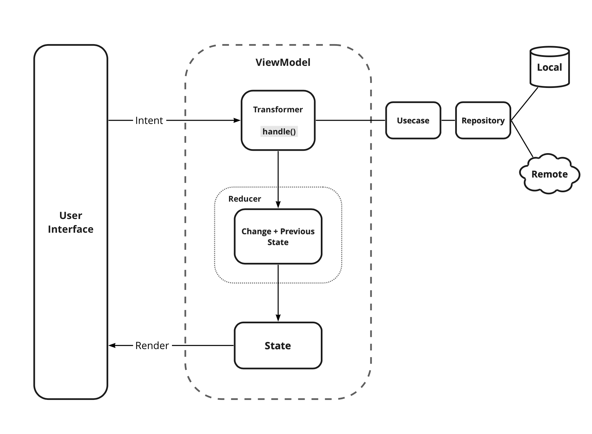

# Project & Code guidelines
The aim of this document is to define repo guidelines. These should be followed throughout the Android project in order to help us to keep our code base clean and consistent. A lot of this will be enforced by code quality checks through lint checks, but it's important to be mindful of the things that may not be picked up.

## 1. File naming
### 1.1 Class files
Class names are written in [UpperCamelCase](http://en.wikipedia.org/wiki/CamelCase).

For classes that extend an Android component, the name of the class should end with the name of the component; for example: `SignInActivity`, `SignInFragment`, `ImageUploaderService`, `ChangePasswordDialog`.

### 1.2 Resources files
Resources file names are written in __[snake_case](https://en.wikipedia.org/wiki/Snake_case)__. i.e. home_activity.xml, add_customer_fragment.xml

#### 1.2.1 Drawable files
Naming conventions for drawables:


| Asset Type   | Prefix             |		Example               |
|--------------| -------------------|-----------------------------|
| Button       | `button_`	        | `button_send_pressed.png` |
| Dialog       | `dialog_`          | `dialog_top.png`          |
| Divider      | `divider_`         | `divider_horizontal_green.png`  |
| Menu         | `menu_	`           | `menu_profile_bg.png`     |
| Notification | `notification_`	| `notification_bg.png`     |
| Tabs         | `tab_`             | `tab_pressed.png`         |
| Background   | `background_`      | `background_grey.png`     |

Naming conventions for selector states:

| State	       | Suffix          | Example                        |
|--------------|-----------------|--------------------------------|
| Normal       | `_normal`       | `button_order_normal.png`    |
| Pressed      | `_pressed`      | `button_order_pressed.png`   |
| Focused      | `_focused`      | `button_order_focused.png`   |
| Disabled     | `_disabled`     | `button_order_disabled.png`  |
| Selected     | `_selected`     | `button_order_selected.png`  |

**Note** - recommended file format for drawables - vector > webp > png.
Also, avoid too long vector paths & limit a vector image to a maximum of 200 x 200 d

#### 1.2.2 Layout files
Layout files should match the name of the Android components that they are intended for but moving the top level component name to the beginning. For example, if we are creating a layout for the `SignInActivity`, the name of the layout file should be `activity_sign_in.xml`.

| Component        | Class Name             | Layout Name                   |
| ---------------- | ---------------------- | ----------------------------- |
| Activity         | `UserProfileActivity`  | `activity_user_profile.xml`   |
| Fragment         | `SignUpFragment`       | `fragment_sign_up.xml`        |
| Dialog           | `ChangePasswordDialog` | `dialog_change_password.xml`  |
| AdapterView item | ---                    | `item_person.xml`             |
| Include / Merge| ---                    | `layout_cart.xml`             |

#### 1.2.3 Menu files
Similar to layout files, menu files should match the name of the component. For example, if we are defining a menu file that is going to be used in the `UserActivity`, then the name of the file should be `user_activity.xml`

#### 1.2.4 Values files
Resource files in the values folder should be __plural__, e.g. `strings_module.xml`, `styles_module.xml`, `colors_module.xml`, `dimens_module.xml`, `attrs_module.xml`

| Module        | Values type            | Layout Name                   |
| ------------- | ---------------------- | ----------------------------- |
| Home          | Strings                | `strings_home.xml`            |
| Supplier      | Dimens                 | `dimens_supplier.xml`         |
| Rewards       | Colors                 | `colors_rewards.xml`          |

#### 1.2.5 Module related files
- module build.gradle :
    - Concrete module : `module.gradle`
    - Contract module : `module.contract.gradle`
- Consumer rules : `consumer-rules-module.pro`
- Analytics tracker : `<Feature>EventTracker`, eg. `CustomerEventTracker`
- Module name with multiple words : separate by `-` (hyphen) - eg. `ok-doc`
- Package name with multiple words : nested packages - eg. `dashboard.profile`
- Strings XML : `strings_module.xml`


## 2. Kotlin language rules
### 2.1 Don't ignore exceptions
You must never do the following:

```Kotlin
fun setServerPort(String value) {
    try {
        serverPort = Integer.parseInt(value);
    } catch (NumberFormatException e) { }
}
```

_While you may think that your code will never encounter this error condition or that it is not important to handle it, ignoring exceptions like above creates mines in your code for someone else to trip over some day. You must handle every Exception in your code in some principled way. The specific handling varies depending on the case._ - ([Android code style guidelines](https://source.android.com/source/code-style.html))

See alternatives [here](https://source.android.com/source/code-style.html#dont-ignore-exceptions).

At times you might want to ignore some exceptions and let the app run without notifying anything to user. In such cases, log it as a non-fatal exception on firebase using `RecordException.recordException()`

### 2.2 Don't catch generic exception
You should not do this:

```java
try {
    someComplicatedIOFunction();        // may throw IOException
    someComplicatedParsingFunction();   // may throw ParsingException
    someComplicatedSecurityFunction();  // may throw SecurityException
    // phew, made it all the way
} catch (Exception e) {                 // I'll just catch all exceptions
    handleError();                      // with one generic handler!
}
```

See the reason why and some alternatives [here](https://source.android.com/source/code-style.html#dont-catch-generic-exception)

### 2.3 Don't use finalizers
_We don't use finalizers. There are no guarantees as to when a finalizer will be called, or even that it will be called at all. In most cases, you can do what you need from a finalizer with good exception handling. If you absolutely need it, define a `close()` method (or the like) and document exactly when that method needs to be called. See `InputStream` for an example. In this case it is appropriate but not required to print a short log message from the finalizer, as long as it is not expected to flood the logs._ - ([Android code style guidelines](https://source.android.com/source/code-style.html#dont-use-finalizers))

## 3. Kotlin style rules
### 3.1 Fields definition and naming
Fields should be defined at the __top of the file__ and they should follow the naming rules listed below.

* All the variable name start with a lower case letter
* Static final fields (constants) are in SCREAMING_SNAKE_CASE.

Example:

```kotlin
class MyClass {

    companion object {
       const val SOME_CONSTANT = 42
    }

    int publicField;
    private int mPrivate;
    internal int mProtected;
}
```

### 3.2 Treat acronyms as words

| Good             | Bad              |
| ---------------  | ---------------- |
| `XmlHttpRequest` | `XMLHTTPRequest` |
| `getCustomerId`  | `getCustomerID`  |
| `String url`     | `String URL`     |
| `long id`        | `long ID`        |
| `ApiClient`        | `APIClient`        |

### 3.3 Use standard brace style
Braces go on the same line as the code before them.

```koylin
class UpdateCustomer @Inject constructor (
    val customerRepository: Lazy<CustomerRepository>,
    val getActiveMerchant: Lazy<GetActiveMerchant>,
) {
    ...
}
```

Braces around the statements are required even if the condition and the body fit in one line.

### 3.4 Logging guidelines
Use the logging methods provided by the `Timber` class to print out error messages or other information that may be useful for developers to identify issues:

* `Timber.v(msg: String)` (verbose)
* `Timber.d(msg: String)` (debug)
* `Timber.i(msg: String)` (information)
* `Timber.w(msg: String)` (warning)
* `Timber.e(t: Throwable)` (error)

It is recommended to remove most of the logs added for development, dev. testing before merging the code. Some on the logs on major flows can be left which could be useful in case of remote debugging.

### 3.5 String constants, naming, and values
Many elements of the Android SDK such as `SharedPreferences`, `Bundle`, or `Intent` use a key-value pair approach so it's very likely that even for a small app you end up having to write a lot of String constants.

When using one of these components, you __must__ define the keys as a `const` fields and they should be prefixed as indicated below.

| Element            | Field Name Prefix    |
| -----------------  | ---------------------|
| SharedPreferences  | `PREF_`     	    |
| Bundle             | `BUNDLE_`            |
| Fragment Arguments | `ARG_`               |
| Intent Extra       | `EXTRA_`             |
| Intent Action      | `ACTION_`            |
| Firebase Remote Config     | `FRC_`            |

### 3.6 Arguments in Fragments and Activities
When data is passed into an `Activity` or `Fragment` via an `Intent` or a `Bundle`, the keys for the different values __must__ follow the rules described in the section above.

When an `Activity` or `Fragment` expects arguments, it should provide a static method in `companion object` that facilitates the creation of the relevant `Intent` or `Fragment`.

In the case of Activities the method is usually called `newIntent()`:

```kotlin
companion object {
   fun newIntent(Context context, User user): Intent {
        val intent = Intent(context, ThisActivity.class)
        intent.putParcelableExtra(EXTRA_USER, user)
        return intent
    }
}
```

For Fragments it should be named `newInstance()` and handles the creation of the Fragment with the right arguments:

```kotlin
companion object {
    fun newInstance(User user): UserFragment {
        val fragment = UserFragment()
        Bundle args = new Bundle()
    args.putParcelable(ARGUMENT_USER, user)
        fragment.setArguments(args)
    return fragment
    }
}
```

__Note 1__: These methods should go at the top of the class before `onCreate()`.

__Note 2__: If we provide the methods described above, the keys for extras and arguments should be `private` because there is not need for them to be exposed outside the class.

### 3.7 Line length limit
Code lines should not exceed __120 characters__. If the line is longer than this limit there are usually two options to reduce its length:

* Extract a local variable or method (preferable).
* Apply line-wrapping to divide a single line into multiple ones.

There are two __exceptions__ where it is possible to have lines longer than 120:

* Lines that are not possible to split, e.g. long URLs in comments.
* `package` and `import` statements.
* Long SQL queries
* Long string literals

#### 3.7.1 Line-wrapping strategies
There isn't an exact formula that explains how to line-wrap and quite often different solutions are valid. However there are a few rules that can be applied to common cases.

__Break at operators__

For multi-line boolean conditions, there should be line breaks in between conditions, operators at line start. For example:

```
if (customer != null &&
    !isCustomerBlocked &&
    isProfilePicClickable
) {
    ...
}
```

**Note** - add trailing commas wherever possible to avoid merge conflicts.

__Assignment Operator Exception__

An exception to the `break at operators` rule is the assignment operator `=`, where the line break should happen __after__ the operator.

```kotlin
val longName =
        anotherVeryLongVariable + anEvenLongerOne - thisRidiculousLongOne + theFinalOne;
```

__Method chain case__

When multiple methods are chained in the same line - for example when using Builders - every call to a method should go in its own line, breaking the line before the `.`

- Don't :
```kotlin
Picasso.with(context).load("https://www.random.com/images/mrjoe.jpg").into(imageView);
```
- Do :
```kotlin
Picasso.with(context)
        .load("https://www.random.com/images/mrjoe.jpg")
        .into(imageView)
```

__Long parameters case__

When a method has many parameters or its parameters are very long, we should break the line after every comma `,`

- Don't :
```kotlin
loadPicture(context, "https://www.random.com/images/random.jpg", mImageViewProfilePicture, clickListener, "Title of the picture")
```

- Do :

**Note** : use named params whenever there are 3 or more params
```kotlin
loadPicture(
    context = context,
    url = "https://www.random.com/images/mrjoe.jpg",
    imageView = mImageViewProfilePicture,
    listener = clickListener,
    title = "Title of the picture"
)
```

### 3.8 RxJava chains styling
Rx chains of operators require line-wrapping. Every operator must go in a new line and the line should be broken before the `.`

```kotlin
private fun updateStudents(): Completable {
    return localSource.listStudents()
        .firstOrError()
        .flatMapCompletable { commands ->
            remoteSource().updateStudents(commands)
        }
        .doOnCompletable { log("completed") }
}
```

## 4. XML style rules
### 4.1 Use self closing tags
When an XML element doesn't have any contents, you __should__ use self closing tags.

This is good:

```xml
<TextView
    android:id="@+id/text_view_profile"
    android:layout_width="wrap_content"
    android:layout_height="wrap_content" />
```

This is __bad__ :

```xml
<!-- Don't do this! -->
<TextView
    android:id="@+id/text_view_profile"
    android:layout_width="wrap_content"
    android:layout_height="wrap_content" >
</TextView>
```

**Note** - always format xmls before committing code


### 4.2 Resources naming
Resource IDs and names should be written in **camelCase** (not snake_case)
- use camelcase - eg. `buttonSubmit`
- use view types `button`, `text`, etc, as **prefix** - eg. `buttonSubmit`, `textName`

#### 4.2.1 ID naming
IDs should be prefixed with the name of the element in camelCase. For example:

Element | Prefix
-- | --
ImageView | image
TextView | text
EditText | edit
Fragment | fragment
RelativeLayout | layout
Button | button
View | view

Button example:

```xml
<Button
    android:id="@+id/buttonSubmit"
    android:layout_width="wrap_content"
    android:layout_height="0dp" />
```

Menu example:

```xml
<menu>
    <item
        android:id="@+id/menuAbout"
        android:title="About" />
</menu>
```

#### 4.2.2 Strings
String names start with a prefix that identifies the section they belong to. For example `registration_email_hint` or `registration_name_hint`. If a string __doesn't belong__ to any section, then you should follow the rules below:


| Prefix               | Description                             |
| ---------------------|-----------------------------------------|
| `error_`             | An error message                        |
| `title_`             | A title, i.e. a dialog title            |
| `action_`            | An action such as "Save" or "Create"    |

## 5. Tests style rules
### 5.1 Unit tests
Test classes should match the name of the class the tests are targeting, followed by `Test`. For example, if we create a test class that contains tests for the `GetMerchant`, we should name it `GetMerchantTest`.

Test method naming should be a sentence enclosed in backticks - eg.

```
@Test
fun `when authenticated user clicks downloadReport then execute DownloadReport`() {
    // given
    ...

    // when
    ...

    // then
    ...
}
```


### 6. The seven rules of a great Git commit message
1. Separate subject from body with a blank line
2. Limit the subject line to 50 characters
3. Capitalize the subject line
4. Do not end the subject line with a period
5. Use the imperative mood in the subject line
6. Wrap the body at 72 characters
7. Use the body to explain what and why vs. how

See [why good commit messages matter](https://chris.beams.io/posts/git-commit/)

# Architecture Guidelines
The architecture of OkCredit Android app is based on the **MVI (Model-View-Intent)** pattern.

### 1. Overview on Model-View-Intent
- Intent is the user’s intent for performing an action like interacting with the User Interface. Example - a click on a button to add a transaction. In this repository, we have named this as UserIntent to avoid confusion with android framework's Intent class.
- View will take an inputs from the user and relay it to the ViewModel in the form of a `UserIntent`s.
- Model represents a state, and to ensure unidirectional data flow, the state is **immutable**.
- View will observe on state and update the UI components accoringly (*single source of truth*).

Read more on MVI - [Link 1](https://hannesdorfmann.com/android/mosby3-mvi-1/), [Link 2](https://proandroiddev.com/architecture-design-exploring-mvi-from-mvvm-334b773f3921)




--------
## 2. Overview

### 2.1 App data sync lifecycle

- `LoginDataSyncer` : sync critical data (accounting), schedule workers for non-critical data. Triggered - at login
- `HomeDataSyncer` : sync data is required on home screen, critical data. Triggered - app open, once in 2 hours
- `HomeRefreshSyncer` : sync critical, non-critical, miscellanoes data. Triggered - home screen pull-to-refresh
- `PeriodicDataSyncer` : sync non-critical data. Triggered - app open, once in 24 hours
- `SignoutImpl` : delete all locally cached data from databases & shared prefs except the data needed across login sessions. Triggered - at logout

### 2.2 WorkManager usage
- Use `OneTimeWorkRequest`, avoid using `PeriodicWorkRequest` to prevent ANRs
- Add Rate-Limits to individual workers using `WorkManager.scheduleWithRateLimit()`
- Avoid adding new data sync lifecycle workers
- For non-critical workers, have BackoffPolicy `EXPONENTIAL` with ExistingWorkPolicy `KEEP`

### 2.3 Analytics
- Write analytics tracker calls preferably in `ViewModel`s
- Create module or feature wise analytics class with required event & property names
- For engineering mertrics (data sync, etc) use `AnalyticsProvider.trackEngineeringMetricEvents()`
- Sample analytics file :
```
class UserStoriesTracker @Inject constructor(
    private val analyticsProvider: Lazy<AnalyticsProvider>,
) {
     object Event {
        const val ADD_STORY_CLICKED = "..."
        ...
    }

    object PropertyKey {
        const val SOURCE = "source"
        ...
    }

    object PropertyValue {
        const val SCREEN = "HomeScreen"
        ...
    }

    fun trackAddStoryClicked() { ... }
}
```


### 2.4 Contract modules
- Create contract module for all concrete modules if any other module has a dependency with it
- Contract module should not depend on other modules and have minimal library dependencies
- Model classes should be a part of concrete module

### 2.5 Module structure
- di - Dependency injection
- analytics - Analytics tracker
- data
    - local - Local source - Room, SharedPreferences
    - remote - Remote source - APIs, Firebase Remote Config
- usecase - Usecases
- ui - User interface


## 3. FAQs :


### 3.1 RxJava - should Observable be used everywhere?
Define as narrow observable as possible : `Completable` -> `Maybe` -> `Single` -> `Observable` -> `Flowable`
Note - prefer coroutines as much as possible over RxJava


### 3.2 When to add field to Firebase Remote Config (FRC)?
Anytime we might need to do sampling, stop some piece of code from running, change the value of some constant. Value from FRC should be read in the remote source.

### 3.3 Where to add strings & resources, in feature module or resources module?
Resources (drawables etc) should be added to resources module in most cases. Strings should preferably added to feature module in `strings_$module.xml` file, duplication is accepted, as we might run strings experiments on them.

### 3.4 Should data source be called directly from usecase?
No, a repository should be present in between data source and usecase.

### 3.5 Where should `wrap()` method be written? (`wrapCompletable()`, `wrapSingle()`, `wrapObservable()`)
~~Usecase~~ ViewModel, for easier testing of usecase.

### 3.6 A new screen should be created as Activity or Fragment?
(WIP) We have not yet taken a decision if we will continue using or remove Navigation Component.

### 3.7 Create multiple Usecases or one Helper class?
Helper class is a class with multiple public methods related to a feature. Usecase is a class with one public method (named `execute()`). To promote SRP (single responsibility principle) and readability, ~~helper~~ usecases should be created.

### 3.8 New classes should be written in RxJava or Coroutines?
Preferably coroutines, except for ViewModel (at present we have MVI implemented with RxJava).

### 3.9 Interface required for LocalSource or RemoteSource?
Not required

### 3.10 Should a view function be called directly from on event listeners? Example - show bottom sheet from on click listener
No, this violates MVI pattern. `pushIntent()` or `clicks()` should to relay intent to ViewModel and ViewModel should `emitViewEvent()` with the required view event.


# License
```
Licensed under the Apache License, Version 2.0 (the "License");
you may not use this file except in compliance with the License.
You may obtain a copy of the License at

    http://www.apache.org/licenses/LICENSE-2.0

Unless required by applicable law or agreed to in writing, software
distributed under the License is distributed on an "AS IS" BASIS,
WITHOUT WARRANTIES OR CONDITIONS OF ANY KIND, either express or implied.
See the License for the specific language governing permissions and
limitations under the License.
```
